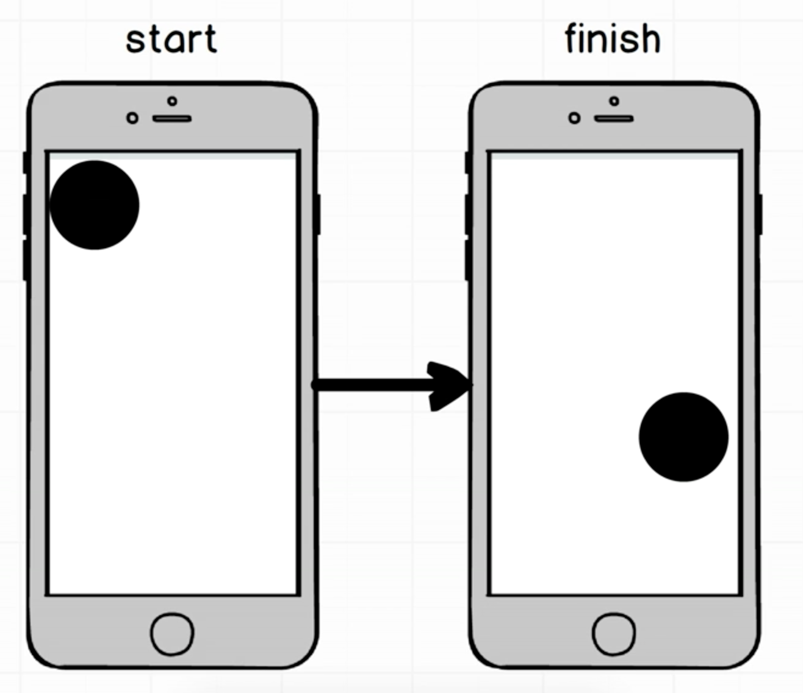
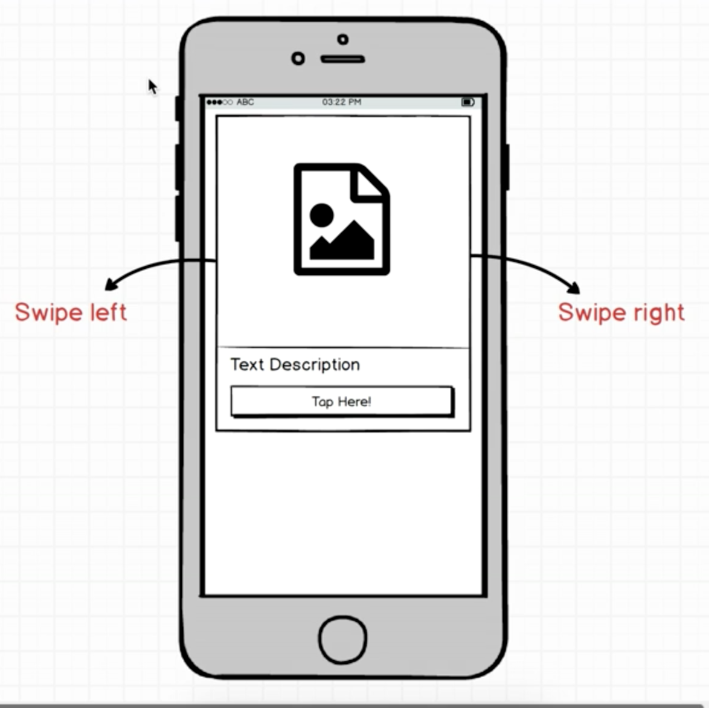

# Swipe, Udemy tutorial
Simple app, following advanced Udemy [React Native: Advanced Concepts course](https://www.udemy.com/react-native-advanced/learn/v4/overview)
## Main Goal
Practice more advanced React Native concepts such as Animation. 


### [Demo - Try it on Expo](https://expo.io/@jkhusanov/swipe-udemy)

## Demo


## Getting started

```
git clone https://github.com/jkhusanov/swipe-udemy.git

exp start

exp ios


```

### TODO

- [x] Start with simple ball animation to get started with **Animated** library
  - [x] Animate the ball
- [x] Add **Cards** and animate one of them
- [x] Add animation to all Cards and **Remove** each of them after a swipe to right/left
- [x] Implement **Cascade** elements, and improve animation with LayoutAnimation 
- [x] Attach screenshots/gif of screens to `README.MD`

### Wireframes
<div style={{display: flex; flex-direction: row}}>
  
  
</div>
